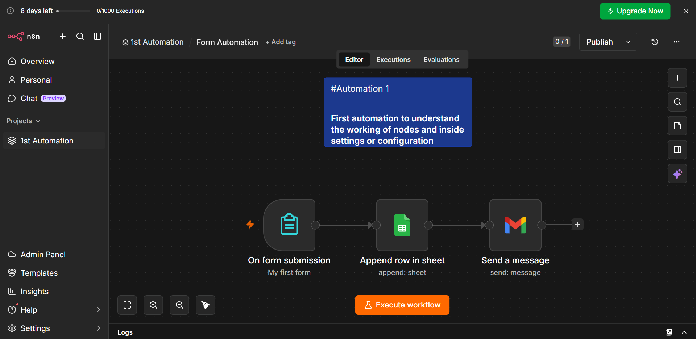

# Lead Capture & Auto-Response Automation

An n8n workflow that automatically captures form submissions, logs them to Google Sheets, and triggers an instant personalized email reply — removing the manual delay between lead submission and first response.

## What It Does

This workflow automates the first-touch process in a lead pipeline, end to end with no manual intervention:

1. **Trigger** — A form submission automatically fires the workflow.
2. **Store** — The lead's details are appended as a new row in Google Sheets, building a running, queryable log of every submission.
3. **Respond** — Gmail sends an automatic, personalized reply to the lead immediately — confirming receipt and setting expectations for next steps.

The result: every lead is logged and acknowledged within seconds, with zero manual handling required.

## Why This Matters

Manual lead handling has two recurring failure points: leads sit unacknowledged for hours, and records get lost across email threads. This workflow solves both — leads are logged consistently the moment they come in, and the sender hears back instantly, with no human in the loop until follow-up is needed.

## Workflow Breakdown

| Stage | Node Type | Function |
|---|---|---|
| Trigger | Form Trigger | Fires automatically the moment a form is submitted |
| Storage | Google Sheets (Append Row) | Logs the lead's details into a running sheet |
| Response | Gmail (Send a Message) | Sends an automatic reply to the lead |

## Tech Stack

- **n8n** — workflow orchestration
- **n8n Form Trigger** — captures submissions, no external form tool needed
- **Google Sheets** — lead data storage
- **Gmail** — automated response delivery

## Setup

1. Import `form-workflow.json` into your n8n instance: **Workflows → Import from File**.
2. Connect your Google Sheets credentials in the "Append row in sheet" node, and point it at your target spreadsheet.
3. Connect your Gmail credentials in the "Send a message" node.
4. Customize the auto-reply email template with your own copy.
5. Publish the workflow and share the form link, or embed the form, to go live.

## Roadmap / Next Iteration

- Add an **AI node** (Claude/OpenAI) to score, categorize, or summarize incoming leads before they're logged — turning this from a pure automation into an AI-augmented pipeline.
- Add conditional routing (e.g., high-priority leads also trigger a Slack alert).
- Add basic validation/deduplication before the row is appended.

## Screenshot

---

*Part of an ongoing portfolio of n8n automation workflows — see other repos for AI-integrated examples.*
